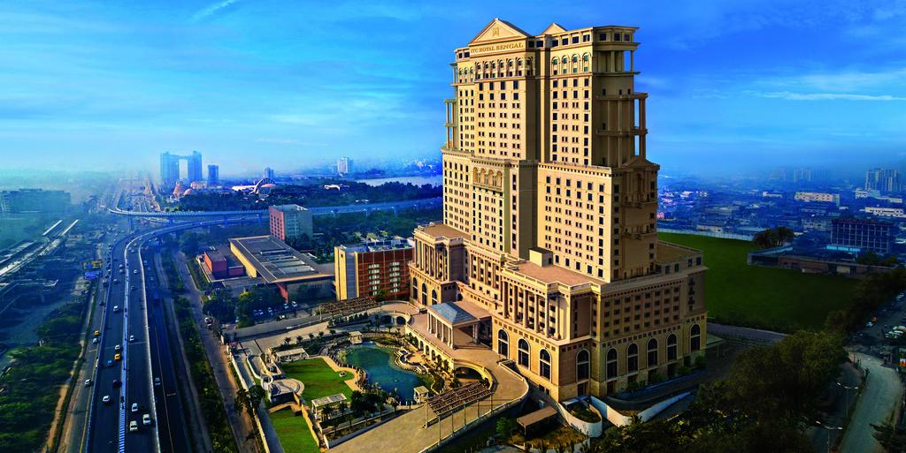
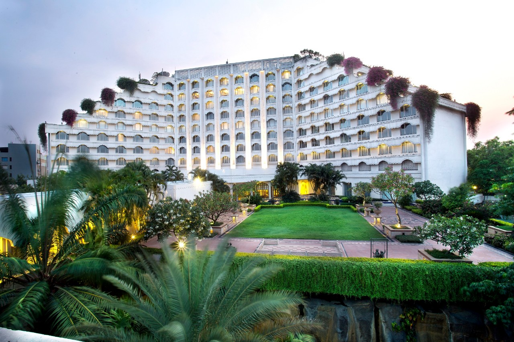

## Welcome to Nitin Sharma's Portfolio.
[](https://www.linkedin.com/in/hoteliernitinsharma/)

<strong>J'espère que vous aimez | Spero ti piaccia | Надеюсь, вам понравится </strong>
<style> 
 #nitin{
  position: relative;
  animation: myfirst 5s 2;
  animation-direction: alternate;
}

@keyframes myfirst {
  0%   {left: 0px; top: 0px;}
  25%  { left: 200px; top: 0px;}
  50%  { left: 0px; top: 0px;}
  75%  { left: 200px; top: 0px;}
  100% { left: 0px; top: 0px;}
}
</style>
<div id="nitin">

</div>
### 💯Welcoming you all here!!!: 
<h3>
  <strong>Namaskar!.</strong> A hotelier with dream to serve kindness and love to my guests.And creating an experience like they every time feel while sitting in thier home.My job is my world thats why i love it and passionately want to devote my life toward it. 
</h3>

```markdown
My Skills which leverage you for makn
✅ Catering
✅ Communication
✅ Customer Service
✅ Communication
✅ Public Speaking
✅ Making People comfortable around my place and around me🙂
```

### Workaholic Nature Helped Me getting These Wonderful Experiences.
- [ITC Hotels](https://www.itchotels.in/hotels/kolkata/itcroyalbengal.html)
<strong>Designation: H.O.T</strong>
<strong>Location : ITC Sonar,Royal Bengal , Kolkata</strong>
Beginning my career in one of the largest hotel of India the ITC Sonar and Royal Bengal as a F&B personal. 

- [TAJ Group of Hotels](https://www.tajhotels.com/en-in/taj/taj-krishna-hyderabad/)
<strong>Designation: Intern</strong>
<strong>Location : Taj Krishna - Hyderabad</strong>

I had have done my intership from hotel Taj krishna,Hyderabad.I had done my duties as a intern.I worked in all the four majour     departments which is Food Profuction, Food and Beverage, Housekeeping and Front Office.And understood their trends and SOP's. 

### My Values comes from GURUKUL from where i learned hospitality.

```markdown
[IHM Gurudaspur](https://www.ihmgurdaspur.org/)
About Course - Bsc in Hospitality and Hotel Administration.
A degree course includes the study of all majour departments of hotel.
```

## Please Feel Free to Contact me :
### @nsrakeshsharma786@gmail.com


<div class="slideshow-container">

<div class="mySlides fade">
  <div class="numbertext">1 / 2</div>
  
  <div class="text" style="color:black;">ITC Royal Bengal</div>
</div>

<div class="mySlides fade">
  <div class="numbertext">2 / 2</div>
  
  <div class="text" style="color:black;">Taj Krishna</div>
</div>
</div>
<br>
<div style="text-align:center">
  <span class="dot" ></span> 
  <span class="dot" ></span> 
</div>
<script>
window.onload = function() {
  document.getElementsByTagName('footer')[0].style.display = 'none';
};

var slideIndex = 0;
showSlides();

function showSlides() {
  var i;
  var slides = document.getElementsByClassName("mySlides");
  for (i = 0; i < slides.length; i++) {
    slides[i].style.display = "none";
  }
  slideIndex++;
  if (slideIndex > slides.length) {slideIndex = 1}
  slides[slideIndex-1].style.display = "block";
  setTimeout(showSlides, 2000); // Change image every 2 seconds
} 
</script>
